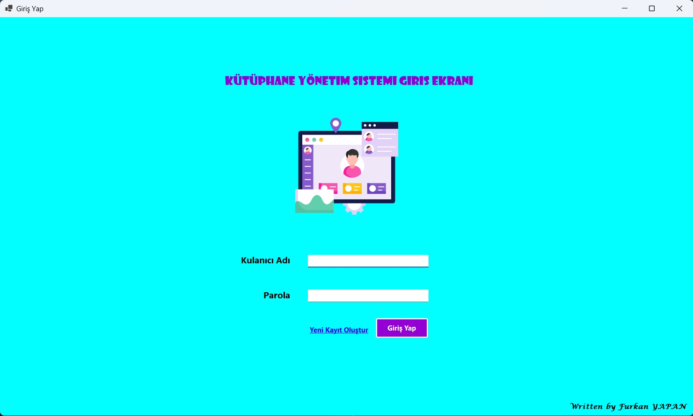
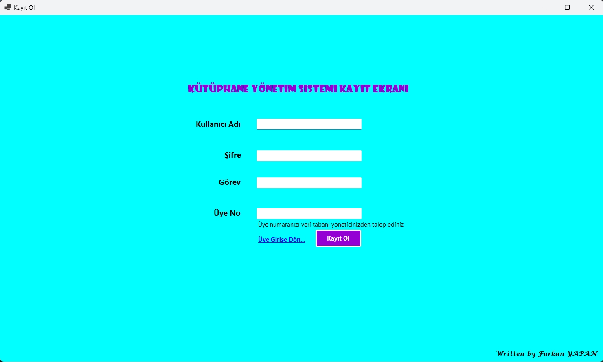
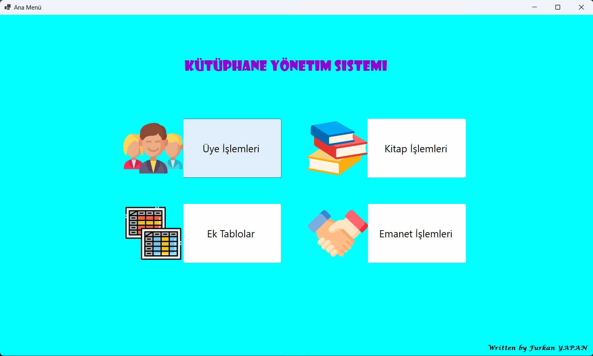
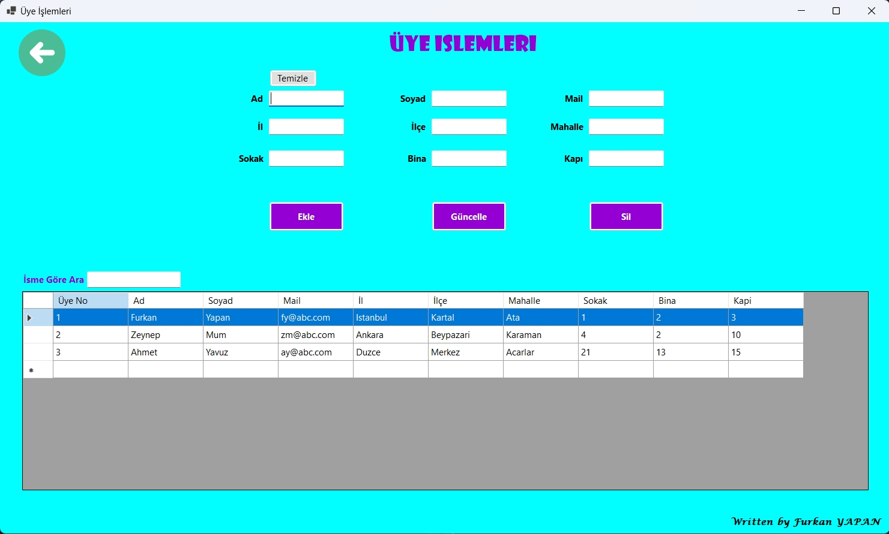
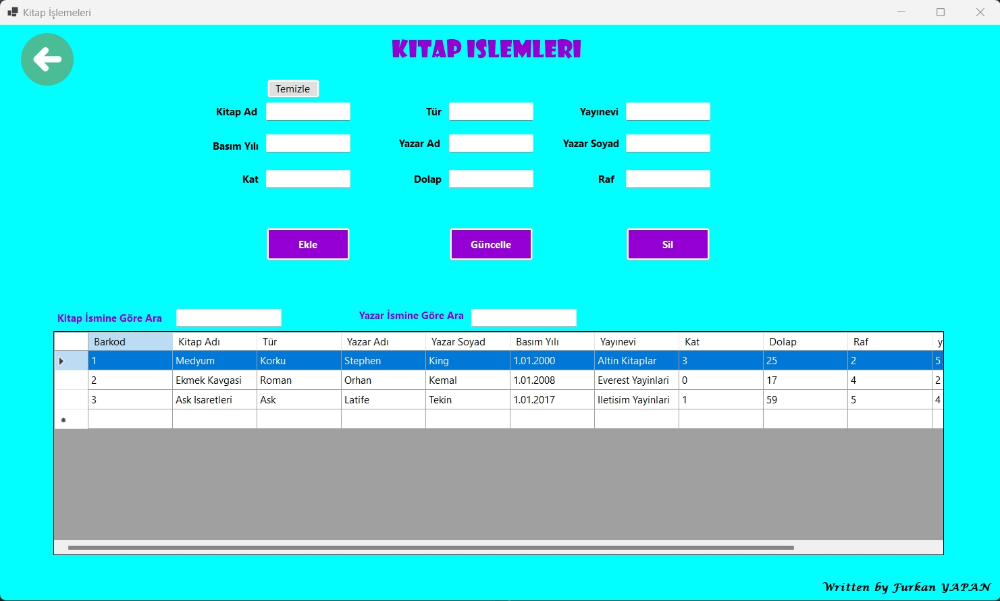
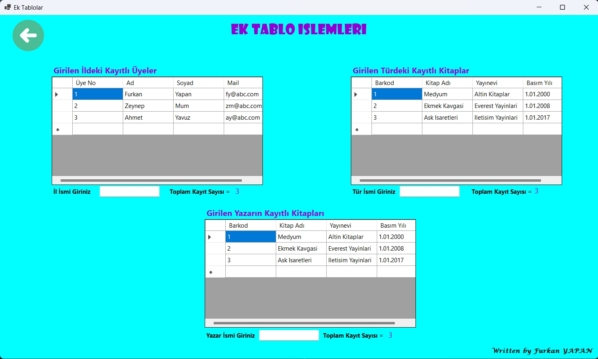
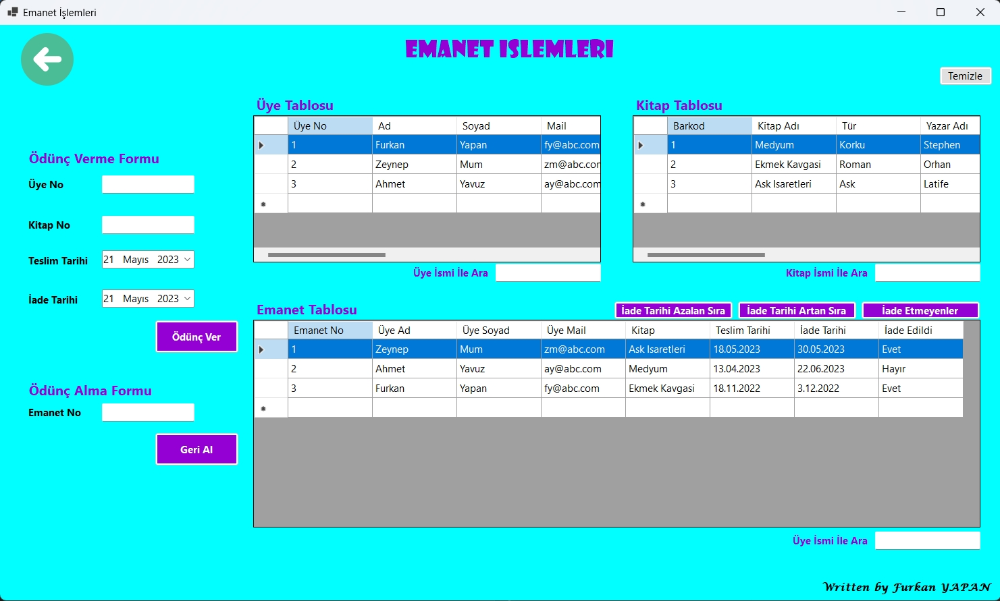
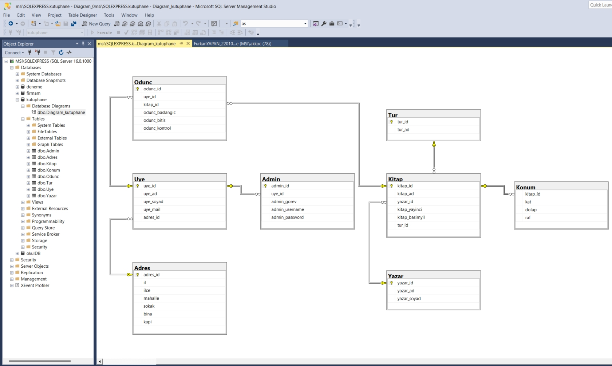

# 📚 Kütüphane Yönetim Sistemi

> **Geliştirici:** Furkan YAPAN  
> **Tarih:** Mayıs 2023  
> **Dil:** C# (.NET 6.0)  
> **Platform:** Windows Forms  
> **Veritabanı:** Microsoft SQL Server Express

---

## 📋 İçindekiler

1. [Genel Bakış](#1-genel-bakış)
2. [Ekran Görüntüleri](#2-ekran-görüntüleri)
3. [Kullanılan Teknolojiler](#3-kullanılan-teknolojiler)
4. [Proje Yapısı](#4-proje-yapısı)
5. [Veritabanı Yapısı](#5-veritabanı-yapısı)
6. [Form Yapıları ve İşlevleri](#6-form-yapıları-ve-i̇şlevleri)
7. [SQL Sorguları](#7-sql-sorguları)
8. [Kurulum](#8-kurulum)

---

## 1. Genel Bakış

Kütüphane Yönetim Sistemi, bir kütüphanenin tüm operasyonlarını dijital ortamda yönetmek için geliştirilmiş masaüstü uygulamasıdır. Sistem aşağıdaki temel fonksiyonları kapsamaktadır:

- **Üye Yönetimi:** Üye kayıt, güncelleme, silme ve arama işlemleri
- **Kitap Yönetimi:** Kitap ekleme, düzenleme, silme ve arama işlemleri
- **Emanet İşlemleri:** Kitap ödünç verme ve iade takibi
- **Raporlama:** İl bazında üye sayısı, tür/yazar bazında kitap istatistikleri
- **Admin Yönetimi:** Sistem yöneticisi hesap işlemleri

---

## 2. Ekran Görüntüleri

### 2.1 Giriş Ekranı (Form1)
Admin kullanıcı girişi için kullanıcı adı ve parola doğrulama ekranı.



---

### 2.2 Kayıt Ekranı (Form2)
Yeni admin kullanıcısı oluşturma ekranı. Kullanıcı adı, şifre, görev ve üye no bilgileri girilir.



---

### 2.3 Ana Menü (Form3)
Sistemin ana navigasyon hub'ı. Dört ana modüle erişim sağlar:
- Üye İşlemleri
- Kitap İşlemleri
- Ek Tablolar (Raporlama)
- Emanet İşlemleri



---

### 2.4 Üye İşlemleri (Form4)
Üye CRUD (Oluştur, Oku, Güncelle, Sil) işlemleri ekranı.

**Özellikler:**
- Üye ekleme (Ad, Soyad, Mail, Adres bilgileri)
- Üye güncelleme
- Üye silme
- İsme göre arama



---

### 2.5 Kitap İşlemleri (Form5)
Kitap CRUD işlemleri ekranı.

**Özellikler:**
- Kitap ekleme (Kitap Adı, Tür, Yayınevi, Basım Yılı, Yazar, Konum)
- Kitap güncelleme ve silme
- Kitap/Yazar adına göre arama
- Fiziksel konum takibi (Kat, Dolap, Raf)



---

### 2.6 Ek Tablolar / Raporlama (Form7)
İstatistiksel raporlar ve filtreleme ekranı.

**Özellikler:**
- İl bazında kayıtlı üyeler ve toplam sayısı
- Tür bazında kayıtlı kitaplar ve toplam sayısı
- Yazar bazında kayıtlı kitaplar ve toplam sayısı



---

### 2.7 Emanet İşlemleri (Form6)
Kitap ödünç verme ve iade takip ekranı.

**Özellikler:**
- Ödünç verme formu (Üye No, Kitap No, Teslim/İade Tarihi)
- Geri alma (iade) formu
- İade tarihi sıralama (Artan/Azalan)
- İade etmeyenler filtresi



---

### 2.8 Veritabanı Diyagramı
SQL Server Management Studio'da oluşturulan veritabanı ilişki diyagramı.



---

## 3. Kullanılan Teknolojiler

| Teknoloji | Versiyon | Açıklama |
|-----------|----------|----------|
| **C#** | .NET 6.0 | Ana programlama dili |
| **Windows Forms** | - | Kullanıcı arayüzü framework'ü |
| **SQL Server Express** | 16.0.1000 | Veritabanı yönetim sistemi |
| **System.Data.SqlClient** | 4.8.5 | Veritabanı bağlantı kütüphanesi |
| **Visual Studio** | 2022 (v17.6) | Geliştirme ortamı |

### Veritabanı Bağlantı Bilgileri

```csharp
SqlConnection con = new SqlConnection(
    @"Data Source=MSI\SQLEXPRESS;Initial Catalog=kutuphane;Integrated Security=True"
);
```

---

## 4. Proje Yapısı

```
kutuphaneYonetim-master/
├── kutuphaneYonetim.sln
├── .gitattributes
├── .gitignore
└── kutuphaneYonetim/
    ├── Program.cs
    ├── Form1.cs / Form1.Designer.cs / Form1.resx
    ├── Form2.cs / Form2.Designer.cs / Form2.resx
    ├── Form3.cs / Form3.Designer.cs / Form3.resx
    ├── Form4.cs / Form4.Designer.cs / Form4.resx
    ├── Form5.cs / Form5.Designer.cs / Form5.resx
    ├── Form6.cs / Form6.Designer.cs / Form6.resx
    ├── Form7.cs / Form7.Designer.cs / Form7.resx
    ├── kutuphaneYonetim.csproj
    ├── Properties/
    └── images/
        ├── admin-panel.png
        ├── admin.png
        ├── handshake.png
        ├── man.png
        ├── previous.png
        ├── stack-of-books.png
        └── table.png
```

---

## 5. Veritabanı Yapısı

### 5.1 Veritabanı Bilgileri

- **Veritabanı Adı:** `kutuphane`
- **Sunucu:** `MSI\SQLEXPRESS`
- **Kimlik Doğrulama:** Windows Authentication

### 5.2 Tablo Yapıları

#### Admin Tablosu
| Kolon | Veri Tipi | Açıklama |
|-------|-----------|----------|
| admin_id | INT (PK) | Admin numarası |
| uye_id | INT (FK) | Üye referansı |
| admin_gorev | NVARCHAR | Admin görevi |
| admin_username | NVARCHAR | Kullanıcı adı |
| admin_password | NVARCHAR | Şifre |

#### Uye Tablosu
| Kolon | Veri Tipi | Açıklama |
|-------|-----------|----------|
| uye_id | INT (PK) | Üye numarası |
| uye_ad | NVARCHAR | Üye adı |
| uye_soyad | NVARCHAR | Üye soyadı |
| uye_mail | NVARCHAR | E-posta |
| adres_id | INT (FK) | Adres referansı |

#### Adres Tablosu
| Kolon | Veri Tipi | Açıklama |
|-------|-----------|----------|
| adres_id | INT (PK) | Adres numarası |
| il | NVARCHAR | İl |
| ilce | NVARCHAR | İlçe |
| mahalle | NVARCHAR | Mahalle |
| sokak | NVARCHAR | Sokak |
| bina | INT | Bina no |
| kapi | INT | Kapı no |

#### Kitap Tablosu
| Kolon | Veri Tipi | Açıklama |
|-------|-----------|----------|
| kitap_id | INT (PK) | Barkod |
| kitap_ad | NVARCHAR | Kitap adı |
| kitap_basimyil | NVARCHAR | Basım yılı |
| kitap_yayinci | NVARCHAR | Yayınevi |
| tur_id | INT (FK) | Tür referansı |
| yazar_id | INT (FK) | Yazar referansı |

#### Yazar Tablosu
| Kolon | Veri Tipi | Açıklama |
|-------|-----------|----------|
| yazar_id | INT (PK) | Yazar numarası |
| yazar_ad | NVARCHAR | Yazar adı |
| yazar_soyad | NVARCHAR | Yazar soyadı |

#### Tur Tablosu
| Kolon | Veri Tipi | Açıklama |
|-------|-----------|----------|
| tur_id | INT (PK) | Tür numarası |
| tur_ad | NVARCHAR | Tür adı |

#### Konum Tablosu
| Kolon | Veri Tipi | Açıklama |
|-------|-----------|----------|
| kitap_id | INT (FK) | Kitap referansı |
| kat | INT | Kat numarası |
| dolap | INT | Dolap numarası |
| raf | INT | Raf numarası |

#### Odunc Tablosu
| Kolon | Veri Tipi | Açıklama |
|-------|-----------|----------|
| odunc_id | INT (PK) | Emanet numarası |
| uye_id | INT (FK) | Üye referansı |
| kitap_id | INT (FK) | Kitap referansı |
| odunc_baslangic | DATE | Teslim tarihi |
| odunc_bitis | DATE | İade tarihi |
| odunc_kontrol | BIT | 0=İade edilmedi, 1=İade edildi |

---

## 6. Form Yapıları ve İşlevleri

| Form | Dosya | Amaç |
|------|-------|------|
| Form1 | Form1.cs | Giriş ekranı (Login) |
| Form2 | Form2.cs | Admin kayıt ekranı |
| Form3 | Form3.cs | Ana menü |
| Form4 | Form4.cs | Üye CRUD işlemleri |
| Form5 | Form5.cs | Kitap CRUD işlemleri |
| Form6 | Form6.cs | Emanet işlemleri |
| Form7 | Form7.cs | Raporlama |

---

## 7. SQL Sorguları

### Veritabanı Oluşturma

```sql
CREATE DATABASE kutuphane;
GO
USE kutuphane;
GO

CREATE TABLE Adres (
    adres_id INT IDENTITY(1,1) PRIMARY KEY,
    il NVARCHAR(50), ilce NVARCHAR(50),
    mahalle NVARCHAR(100), sokak NVARCHAR(100),
    bina INT, kapi INT
);

CREATE TABLE Uye (
    uye_id INT IDENTITY(1,1) PRIMARY KEY,
    uye_ad NVARCHAR(50), uye_soyad NVARCHAR(50),
    uye_mail NVARCHAR(100),
    adres_id INT FOREIGN KEY REFERENCES Adres(adres_id)
);

CREATE TABLE Admin (
    admin_id INT IDENTITY(1,1) PRIMARY KEY,
    uye_id INT FOREIGN KEY REFERENCES Uye(uye_id),
    admin_gorev NVARCHAR(50),
    admin_username NVARCHAR(50),
    admin_password NVARCHAR(50)
);

CREATE TABLE Yazar (
    yazar_id INT IDENTITY(1,1) PRIMARY KEY,
    yazar_ad NVARCHAR(50), yazar_soyad NVARCHAR(50)
);

CREATE TABLE Tur (
    tur_id INT IDENTITY(1,1) PRIMARY KEY,
    tur_ad NVARCHAR(50)
);

CREATE TABLE Kitap (
    kitap_id INT IDENTITY(1,1) PRIMARY KEY,
    kitap_ad NVARCHAR(100), kitap_basimyil NVARCHAR(10),
    kitap_yayinci NVARCHAR(100),
    tur_id INT FOREIGN KEY REFERENCES Tur(tur_id),
    yazar_id INT FOREIGN KEY REFERENCES Yazar(yazar_id)
);

CREATE TABLE Konum (
    konum_id INT IDENTITY(1,1) PRIMARY KEY,
    kitap_id INT FOREIGN KEY REFERENCES Kitap(kitap_id),
    kat INT, dolap INT, raf INT
);

CREATE TABLE Odunc (
    odunc_id INT IDENTITY(1,1) PRIMARY KEY,
    uye_id INT FOREIGN KEY REFERENCES Uye(uye_id),
    kitap_id INT FOREIGN KEY REFERENCES Kitap(kitap_id),
    odunc_baslangic DATE, odunc_bitis DATE,
    odunc_kontrol BIT DEFAULT 0
);
```

---

## 8. Kurulum

### Gereksinimler
- Windows 10/11
- .NET 6.0 Runtime
- SQL Server Express 2019+
- Visual Studio 2022

### Adımlar

1. SQL Server Express'i kurun
2. Veritabanı script'ini çalıştırın
3. Connection string'i güncelleyin:
```csharp
@"Data Source=SUNUCU_ADINIZ\SQLEXPRESS;Initial Catalog=kutuphane;Integrated Security=True"
```
4. Visual Studio'da `kutuphaneYonetim.sln` açın ve F5 ile çalıştırın

---

## 🎨 Tasarım

| Özellik | Değer |
|---------|-------|
| Arka Plan | Aqua (#00FFFF) |
| Başlıklar | DarkViolet (#9400D3) |
| Butonlar | DarkViolet / White |
| Ana Font | Showcard Gothic, Segoe UI |
| Form Boyutu | 1482 x 853 px |

---

## 📝 Lisans

Bu proje eğitim amaçlı geliştirilmiştir.

---

*Written by Furkan YAPAN*
